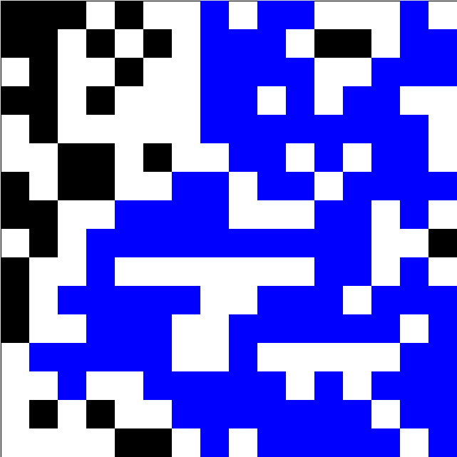
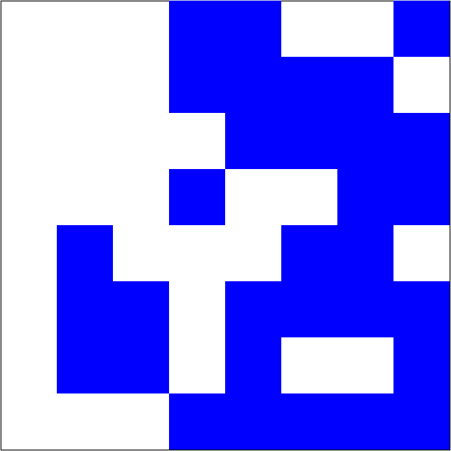

.. _14-2-label:
===============================================================================
問題14.2 - フラクタル次元のくりこみ群による計算
===============================================================================

.. contents::

シミュレーションの目的
===============================================================================

パーコレーション・クラスターを粗視化していくと，\ :math:`p>p_{c}`\ では粗視化後の占有確率\ :math:`p'`\ は元の占有確率\ :math:`p`\ に比べて大きくなるように見える．一方で\ :math:`p<p_{c}`\ の時には\ :math:`p'<p`\ となるように見える．\ :math:`p=p_{c}`\ のときには，すべての長さのスケールが存在し，系を観測するためにどの長さのスケールを使うかは問題でなくなり、したがって\ :math:`p' = p_{c}`\ となる．
今回のシミュレーションでは，もとの格子がセルの端から端を連結しているかどうかを表す1個の格子点で置き換える．また，くりこみ後の各セルは他のすべてのセルとは無関係に，そのセルが占有される確率\ :math:`p'`\ を持つという簡単な近似を行うことにする．このようなくりこみの操作によってクラスターを特徴づける量がどのように変化するかということを観測することによって，有限のサイズのシミュレーションにおいても，臨界指数を計算することができるようになる．

作成したプログラム
===============================================================================

本シミュレーションで作成したプログラムを以下に示す．

くりこみを用いてフラクタル次元を求めるプログラム
-------------------------------------------------------------------------------

今回シミュレーションに用いたプログラムは，問題14.1に用いたプログラムの大部分を流用している．ただし，プログラムの実行のためのダイアログは使用しておらず，くりこみ後の格子の描画を行うなどの目的で，関数draw_canvasの引数の扱いを若干変更してある．また，パーコレートしなかった場合には，再帰的に関数を実行し直すようにし，パーコレートしていない格子が得られないようにしてある(62〜64行目)．
今回新たに定義したのは関数renormalizationで，その名の通り，くりこみを行う関数である．事前にパーコレーション・クラスターが得られている状態で呼び出し，格子のサイズがくりこみのスケール因子\ :math:`b`\ で割り切れる時のみ実行される(割り切れない場合にはエラーが送出される)．くりこみのルールは，上端と下端が連結している時に格子は占有されるとし，上端と下端が連結しないときにはくりこみ後の格子点は占有されないことにする．この操作によって得られたくりこみ後の格子と，もとのパーコレーション・クラスターの2つに関して，その占有された格子点の数を数え，それを2乗した値を返す．これをループで回して10回の平均の値を求め，その値からフラクタル次元\ :math:`D`\ を求めることができる．

* 14-2_fractal_dim_by_renormalization.py(\ :download:`download <14-2_fractal_dim_by_renormalization.py>`\ )

.. literalinclude:: 14-2_fractal_dim_by_renormalization.py
    :language: python
    :linenos:

実習課題
===============================================================================

* もとの格子と，大きさ\ :math:`L' = L/b`\ にくりこまれた格子の両方で，\ :math:`p=p_{c}`\ における端から端まで連結したクラスター内の占有された格子点の数の2乗\ :math:`<M^{2}>`\ および，\ :math:`<M'^{2}>`\ をそれぞれ計算せよ．\ :math:`<M^{2}> \sim R^{2D}`\ であり，\ :math:`<M'^{2}> \sim (R/b)^{2D}`\ でもあるので，関係式\ :math:`b^{2D} = <M^{2}>/<M'^{2}>`\ から\ :math:`D`\ を求めることができる．長さのスケール変換のための因子を\ :math:`b=2`\ と選んで，第13.5節で用いたのと同じブロック法を用いよ．\ :math:`L=16`\ ，\ :math:`p=0.5927`\ の場合に定性的な結果を得るには，10個の端から端まで連結したクラスターについて平均を取れば十分である．

スケール変換のための因子を\ :math:`b=2`\ とおいて，もとの格子のサイズ\ :math:`L=16`\ としたときに，もとの格子と，くりこまれた格子の両方について，パーコレーション・クラスター内の占有サイトの数の2乗を計算し，その値から関係式

.. math:: b^{2D} = \frac{<M^{2}>}{<M'^{2}>}

を用いてフラクタル次元\ :math:`D`\ を求めた．実際に10回目の試行で得られたもとのパーコレーション・クラスターと，くりこまれた後の格子点を，\ :num:`図#fig-14-2-f1`\ ，\ :num:`図#fig-14-2-f2`\ に示す．このとき，1回のプログラム(すなわち10個のサンプル)で得られたフラクタル次元\ :math:`D`\ は\ :math:`D \approx 1.933`\ であった．また，試行回数を50回にし，10回のプログラムの実行によって得られた平均値は\ :math:`D \approx 1.925`\ となり，その偏差\ :math:`\sigma`\ は\ :math:`\sigma \approx 0.01193`\ となった．

.. _fig-14-2-f1:

    
    \ :math:`p=0.5927`\ において得られたサイト・パーコレーションの例

.. _fig-14-2-f2:

    
    \ :math:`b=2`\ によってくりこまれたパーコレーションクラスター

まとめ
===============================================================================

くりこみの考え方を用いた簡単な計算によって，パーコレーション・クラスターのおおよそのフラクタル次元を求めることができた．

参考文献
===============================================================================
* ハーベイ・ゴールド,ジャン・トボチニク,石川正勝・宮島佐介訳 『計算物理学入門』, ピアソン・エデュケーション, 2000.
